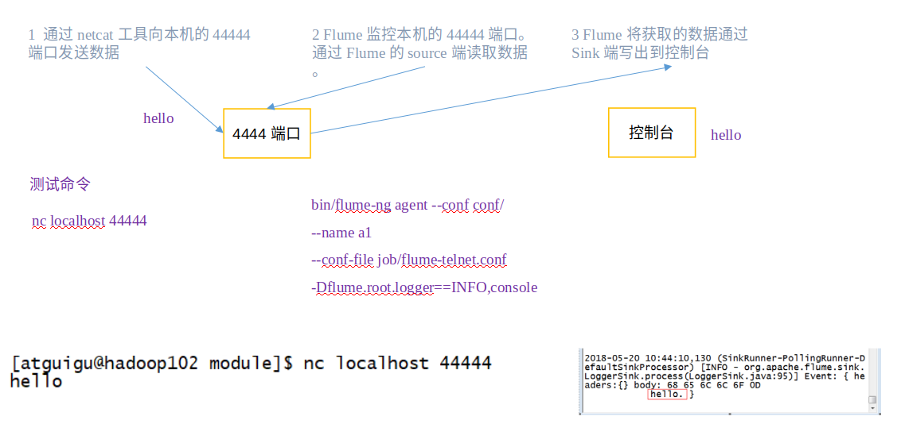

### Flume

***概念***:

Cloudera提供的高可用、高可靠、分布式的海量日志***收集***、***整合和传输***的系统。


***基础架构:***


Agent

一个JVM进程 以***Event***的形式将数据从源头送至目的，包含三个部分。

- Source: 

  负责接收数据到Flume Agent 组件。

  (包括 avro、thrift、exec、jms、spooling directory、netcat、sequence generator、syslog、http、legacy 等类型。)

- Sink: 

  不断轮询Channel 中 的Event。并且批量地溢出他们。并将这些Event批量处理写入到存储或索引系统(或者发送到另一个Flume Agent)

  hdfs、logger、avro、thrift、ipc、file、HBase、solr、自定义。

- Channel: 

  位于Source和Sink之间的缓冲区，所以支持运作在不同的***速率***。而且Channel是线程安全的 。可以同时处理几个Source的***写入*** 和 Sink的***读取***操作。

  分类: Memory Channel 和 File Channel

  - Memory: 内存中的队列。容易丢失。
  - File Memory: 事件写到了磁盘上。不易丢失。

- Evnet: 

  Flume传输的基本***传输单元***。由Header 和 Body 租成。

  Header: 存放Event的一些属性 (K=V结构) 

  Body: 存放数据。

  

- Interceptors:

  在source将event放入到channel之前，调用拦截器对event进行拦截和处理。

- Channel Selectors: 

  当***一个***source对接***多个***channel时，由 Channel Selectors选取channel将event存入。

- Sink Processors:

  当多个sink从一个channel取数据时，为了保证数据的***顺序***，由sink processor从多个sink中挑选一个sink，由这个sink干活


***安装与部署***

官网: http://flume.apache.org/。他是一个客户端，所以直接安装就可以了。

配置手册: http://flume.apache.org/FlumeUserGuide.html

0.9 之前称为flume.og 

0.9之后称为flume.ng


***案例:***

需求



安装netcat工具

```shell
sudo yum install -y nc
```

创建Flume Agent 配置文件flume-netcat-logger.conf

```shell
# Name the components on this agent
a1.sources = r1
a1.sinks = k1
a1.channels = c1

# Describe/configure the source
a1.sources.r1.type = netcat
a1.sources.r1.bind = hadoop102
a1.sources.r1.port = 44444

# Describe the sink
a1.sinks.k1.type = logger

# Use a channel which buffers events in memory
a1.channels.c1.type = memory
a1.channels.c1.capacity = 10000
a1.channels.c1.transactionCapacity = 1000

# Bind the source and sink to the channel
a1.sources.r1.channels = c1
a1.sinks.k1.channel = c1
```

开启Flume监听端口

第一种写法：

```shell
flume-ng agent --conf conf/ --name a1 --conf-file flume-netcat-logger.conf -Dflume.root.logger=INFO,console
```

第二种写法：

```shell
flume-ng agent -c conf/ -n a1 –f flume-netcat-logger.conf -Dflume.root.logger=INFO,console
```

> conf/-c：表示配置文件存储在conf/目录
>
> - --name/-n：表示给agent起名为a1
>
> - --conf-file/-f：flume本次启动读取的配置文件是在job文件夹下的flume-telnet.conf文件。
>
> - -Dflume.root.logger=INFO,console ：-D表示flume运行时动态修改flume.root.logger参数属性值，并将控制台日志打印级别设置为INFO级别。日志级别包括:log、info、warn、error。

使用netcat工具向本机的44444端口发送内容

```shell
nc hadoop102 44444
```


