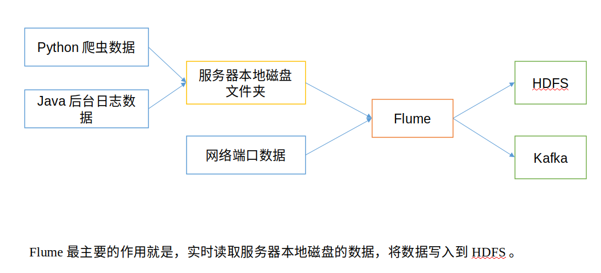
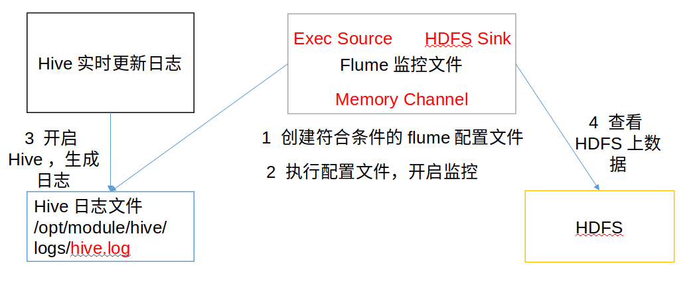
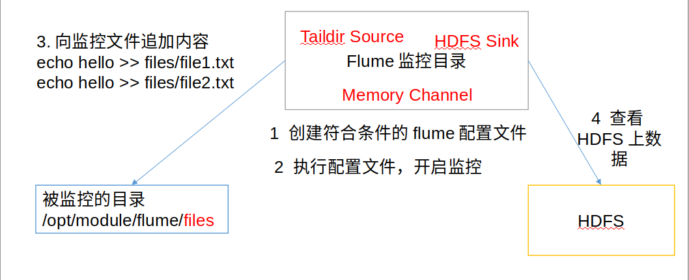
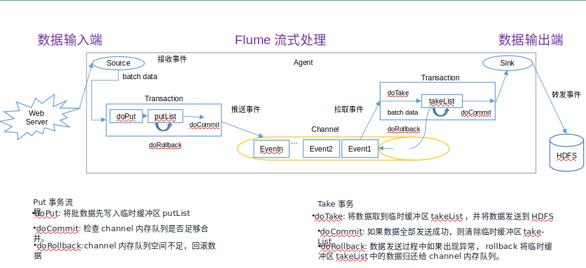
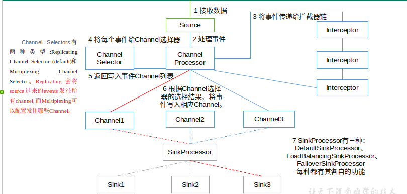
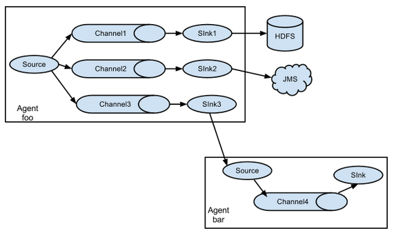

### Flume

***概念***:

Cloudera提供的高可用、高可靠、分布式的海量日志***收集***、***整合和传输***的系统。




***基础架构:***


Agent

一个JVM进程 以***Event***的形式将数据从源头送至目的，包含三个部分。

- Source: 

  负责接收数据到Flume Agent 组件。

  (包括 avro、thrift、exec、jms、spooling directory、netcat、sequence generator、syslog、http、legacy 等类型。)

- Sink: 

  不断轮询Channel 中 的Event。并且批量地溢出他们。并将这些Event批量处理写入到存储或索引系统(或者发送到另一个Flume Agent)

  hdfs、logger、avro、thrift、ipc、file、HBase、solr、自定义。

- Channel: 

  位于Source和Sink之间的缓冲区，所以支持运作在不同的***速率***。而且Channel是线程安全的 。可以同时处理几个Source的***写入*** 和 Sink的***读取***操作。

  分类: Memory Channel 和 File Channel

  - Memory: 内存中的队列。容易丢失。
  - File Memory: 事件写到了磁盘上。不易丢失。

- Evnet: 

  Flume传输的基本***传输单元***。由Header 和 Body 租成。

  Header: 存放Event的一些属性 (K=V结构) 

  Body: 存放数据。

  

- Interceptors:

  在source将event放入到channel之前，调用拦截器对event进行拦截和处理。

- Channel Selectors: 

  当***一个***source对接***多个***channel时，由 Channel Selectors选取channel将event存入。

- Sink Processors:

  当多个sink从一个channel取数据时，为了保证数据的***顺序***，由sink processor从多个sink中挑选一个sink，由这个sink干活


***安装与部署***

官网: http://flume.apache.org/。他是一个客户端，所以直接安装就可以了。

配置手册: http://flume.apache.org/FlumeUserGuide.html

0.9 之前称为flume.og 

0.9之后称为flume.ng


***案例:***

需求


安装netcat工具

```shell
sudo yum install -y nc
```

创建Flume Agent 配置文件flume-netcat-logger.conf

```shell
# Name the components on this agent
a1.sources = r1
a1.sinks = k1
a1.channels = c1

# Describe/configure the source
a1.sources.r1.type = netcat
a1.sources.r1.bind = hadoop102
a1.sources.r1.port = 44444

# Describe the sink
a1.sinks.k1.type = logger

# Use a channel which buffers events in memory
a1.channels.c1.type = memory
a1.channels.c1.capacity = 10000
a1.channels.c1.transactionCapacity = 1000

# Bind the source and sink to the channel
a1.sources.r1.channels = c1
a1.sinks.k1.channel = c1
```

开启Flume监听端口

第一种写法：

```shell
flume-ng agent --conf conf/ --name a1 --conf-file flume-netcat-logger.conf -Dflume.root.logger=INFO,console
```

第二种写法：

```shell
flume-ng agent -c conf/ -n a1 –f flume-netcat-logger.conf -Dflume.root.logger=INFO,console
```

> conf/-c：表示配置文件存储在conf/目录
>
> - --name/-n：表示给agent起名为a1
>
> - --conf-file/-f：flume本次启动读取的配置文件是在job文件夹下的flume-telnet.conf文件。
>
> - -Dflume.root.logger=INFO,console ：-D表示flume运行时动态修改flume.root.logger参数属性值，并将控制台日志打印级别设置为INFO级别。日志级别包括:log、info、warn、error。

使用netcat工具向本机的44444端口发送内容

```shell
nc hadoop102 44444
```


案例一: 实时监控单个文件

实时监控Hive日志 并上传到HDFS中



flume-file-hdfs.conf

```shell
# Name the components on this agent
a2.sources = r2
a2.sinks = k2
a2.channels = c2

# Describe/configure the source
a2.sources.r2.type = exec
a2.sources.r2.command = tail -F /opt/module/hive/logs/hive.log
a2.sources.r2.shell = /bin/bash -c

# Describe the sink
a2.sinks.k2.type = hdfs
a2.sinks.k2.hdfs.path = hdfs://hadoop102:9000/flume/%Y%m%d/%H
#上传文件的前缀
a2.sinks.k2.hdfs.filePrefix = logs-
#是否按照时间滚动文件夹
a2.sinks.k2.hdfs.round = true
#多少时间单位创建一个新的文件夹
a2.sinks.k2.hdfs.roundValue = 1
#重新定义时间单位
a2.sinks.k2.hdfs.roundUnit = hour
#是否使用本地时间戳
#说明: 
#对于所有与时间相关的转义序列，Event Header中必须存在以 “timestamp”的key（除非hdfs.useLocalTimeStamp设置为true，此方法会使用TimestampInterceptor自动添加timestamp）
a2.sinks.k2.hdfs.useLocalTimeStamp = true
#积攒多少个Event才flush到HDFS一次
a2.sinks.k2.hdfs.batchSize = 100
#多久生成一个新的文件
a2.sinks.k2.hdfs.rollInterval = 60
#设置每个文件的滚动大小
a2.sinks.k2.hdfs.rollSize = 134217700
#文件的滚动与Event数量无关
a2.sinks.k2.hdfs.rollCount = 0

# Use a channel which buffers events in memory
a2.channels.c2.type = memory
a2.channels.c2.capacity = 10000
a2.channels.c2.transactionCapacity = 1000

# Bind the source and sink to the channel
a2.sources.r2.channels = c2
a2.sinks.k2.channel = c2
```

> 注：要想读取Linux系统中的文件，就得按照Linux命令的规则执行命令。由于Hive日志在Linux系统中所以读取文件的类型选择：exec即execute执行的意思。表示执行Linux命令来读取文件。


案例二: 监控多个新文件

监控整个目录的文件 并上传到HDFS


flume-dir-hdfs.conf

```shell
a3.sources = r3
a3.sinks = k3
a3.channels = c3

# Describe/configure the source
a3.sources.r3.type = spooldir
a3.sources.r3.spoolDir = /opt/module/flume/upload
a3.sources.r3.fileSuffix = .COMPLETED
#忽略所有以.tmp结尾的文件，不上传
a3.sources.r3.ignorePattern = \\S*\\.tmp

# Describe the sink
a3.sinks.k3.type = hdfs
a3.sinks.k3.hdfs.path = hdfs://hadoop102:9000/flume/upload/%Y%m%d/%H
#上传文件的前缀
a3.sinks.k3.hdfs.filePrefix = upload-
#是否按照时间滚动文件夹
a3.sinks.k3.hdfs.round = true
#多少时间单位创建一个新的文件夹
a3.sinks.k3.hdfs.roundValue = 1
#重新定义时间单位
a3.sinks.k3.hdfs.roundUnit = hour
#是否使用本地时间戳
a3.sinks.k3.hdfs.useLocalTimeStamp = true
#积攒多少个Event才flush到HDFS一次
a3.sinks.k3.hdfs.batchSize = 100
#设置文件类型，可支持压缩
a3.sinks.k3.hdfs.fileType = DataStream
#多久生成一个新的文件
a3.sinks.k3.hdfs.rollInterval = 60
#设置每个文件的滚动大小大概是128M
a3.sinks.k3.hdfs.rollSize = 134217700
#文件的滚动与Event数量无关
a3.sinks.k3.hdfs.rollCount = 0

# Use a channel which buffers events in memory
a3.channels.c3.type = memory
a3.channels.c3.capacity = 10000
a3.channels.c3.transactionCapacity = 1000

# Bind the source and sink to the channel
a3.sources.r3.channels = c3
a3.sinks.k3.channel = c3
```

> 说明：在使用Spooling Directory Source时
>
> 不要在监控目录中创建并持续修改文件
>
> 上传完成的文件会以.COMPLETED结尾
>
> 被监控文件夹每500毫秒扫描一次文件变动


案例三: 实时监控多个文件

监听整个目录的实时追加文件 并上传到HDFS

> ***Exec source***适用于监控一个***实时追加的文件***，但不能保证数据不***丢失***；
>
> ***Spooldir Source***能够保证数据不丢失，且能够实现断点续传，但***延迟较高***，***不能实时***监控；
>
> ***taildir Source***既能够实现断点续传，又可以保证数据不丢失，还能够进行时监控。( taildir YES! )



flume-taildir-hdfs.conf

```shell
a3.sources = r3
a3.sinks = k3
a3.channels = c3

# Describe/configure the source
a3.sources.r3.type = TAILDIR
a3.sources.r3.positionFile = /opt/module/flume/tail_dir.json
a3.sources.r3.filegroups = f1
a3.sources.r3.filegroups.f1 = /opt/module/flume/files/file.*

# Describe the sink
a3.sinks.k3.type = hdfs
a3.sinks.k3.hdfs.path = hdfs://hadoop102:9000/flume/upload/%Y%m%d/%H
#上传文件的前缀
a3.sinks.k3.hdfs.filePrefix = upload-
#是否按照时间滚动文件夹
a3.sinks.k3.hdfs.round = true
#多少时间单位创建一个新的文件夹
a3.sinks.k3.hdfs.roundValue = 1
#重新定义时间单位
a3.sinks.k3.hdfs.roundUnit = hour
#是否使用本地时间戳
a3.sinks.k3.hdfs.useLocalTimeStamp = true
#积攒多少个Event才flush到HDFS一次
a3.sinks.k3.hdfs.batchSize = 100
#设置文件类型，可支持压缩
a3.sinks.k3.hdfs.fileType = DataStream
#多久生成一个新的文件
a3.sinks.k3.hdfs.rollInterval = 60
#设置每个文件的滚动大小大概是128M
a3.sinks.k3.hdfs.rollSize = 134217700
#文件的滚动与Event数量无关
a3.sinks.k3.hdfs.rollCount = 0

# Use a channel which buffers events in memory
a3.channels.c3.type = memory
a3.channels.c3.capacity = 10000
a3.channels.c3.transactionCapacity = 1000

# Bind the source and sink to the channel
a3.sources.r3.channels = c3
a3.sinks.k3.channel = c3
```

> Taildir Source维护了一个json格式的position File，其会定期的往position File中更新每个文件读取到的最新的位置，因此能够实现断点续传。Position File的格式如下：
>
> {"inode":2496272,"pos":12,"file":"/opt/module/flume/files/file1.txt"}
>
> {"inode":2496275,"pos":12,"file":"/opt/module/flume/files/file2.txt"}
>
> 注：Linux中储存文件元数据的区域就叫做i***node***，每个inode都有一个***号码***，操作系统用inode号码来识别不同的文件，Unix/Linux系统内部不使用文件名，而使用inode号码


Flume进阶

- Flume事务

  

- Flume Agent 内部原理

  

  重要组件

  1. ChannelSelector (分为 Replicating 和 Multiplexing)
  2. SinkProcessor (分为 DefaultSinkPeocessor LoadBalancing 和 FailoverSinkProcessor)

- Flume  拓扑结构

  简单串联

  

  复制和多路复用

  

  负载均衡和故障转移

  

  聚合 (常用且实用)

  每个服务器都部署一个Flume采集日志 传输到一个集中收集日志的Flume  再由此服务器传输到HDFS, Hive, HBase 等 进行日志分析.

  

  

​	


