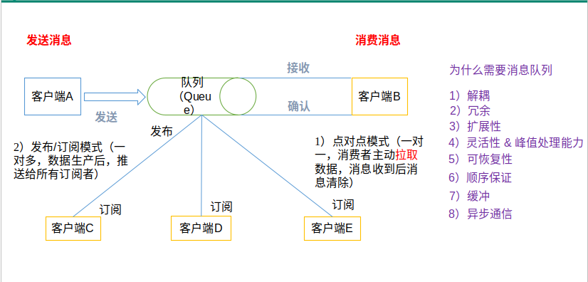
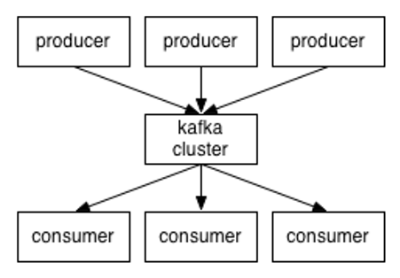
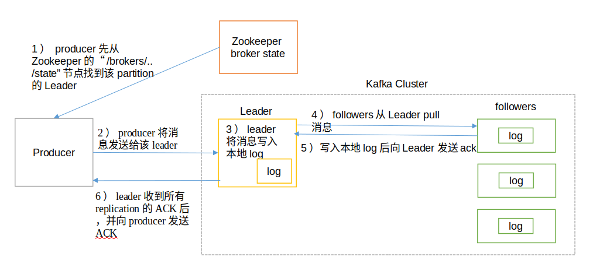

### Kafka

- 消息队列(用于解耦)内部实现原理

  

  - 点对点模式(一对一)

    基于***拉取***或者***轮询*** 。特点是发送到队列的消息被***一个且只有一个***接收者接收处理，即使有多个消息监听者也是如此。

  - 发布/订阅模式(一对多)

    基于***推送***的消息传输模型。分为临时订阅者(只在主动监听主题时才接收消息)和持久订阅者(监听主题的所有消息, 即使当前不可用, 处于离线状态)。

- Kafka定义: 

  Kafka 主要是用于缓存数据 (Scala编写) 是一个分布式的消息队列(端口: 2181)

  - 根据**Topic** 进行分类, 发送方称为 **Producer** 接收方称为**Consumer** 。

    > **Kafka 集群**有多个Kafka**实例**组成, 每个实例(Server)称为**broker(注意broker.id 不可以重复)**。无论是集群还是consumer都依赖于zookeeper中的meta信息

  - kafka 架构

    

    

    > Partition：为了实现扩展性，一个非常大的topic可以分布到多个broker（即服务器）上。
    >
    > 一个**topic**可以分为多个**partition**，每个**partition**是一个有序的**队列**。
    >
    > partition中的每条消息都会被分配一个**有序的id**（offset）。
    >
    > kafka只保证按一个partition中的**顺序**将消息发给**consumer**，**不保证**一个topic的**整体**（多个partition间）的顺序

  - Kafka 命令行操作:

    1. 查看所有topic

       ```shell
       bin/kafka-topics.sh --zookeeper hadoop102:2181 --list
       ```

    2. 创建topic

       ```shell
       bin/kafka-topics.sh --zookeeper hadoop102:2181 --create --topic first --partitions 1 --replication-factor 3 
       ```

    3. 删除topic

       ```shell
       bin/kafka-topics.sh --zookeeper hadoop102:2181 --delete --topic first
       ```

       > 需要在server.properties中设置delete.topic.enable = true 否则只是标记删除

    4. 发送消息

       ```shell
       bin/kafka-console-producer.sh --broker-list hadoop102:9092 --topic first
       >hello world
       >fxxku  fxxku
       ```

    5. 消费消息

       ```shell
       bin/kafka-console-consumer.sh --zookeeper hadoop102:2181 --from-beginning --topic first
       ```

       > --from-begining 会把first主题中之前所有的数据都读取出来(根据业务选择是否开启)

    6. 查看某个topic详情

       ```shell
       bin/kafka-topics.sh --zookeeper hadoop102:2181 --describe --topic first
       ```

- Kafka工作流程分析:

  

  - 生产过程分析:

    1. 写入方式: 

       push(producer) -> broker -> append -> partition (顺序写磁盘)

       > 顺序写磁盘比随机写内存的效率更高 保证Kafka吞吐率

    2. 分区(partition):

       消息发送的时候都被发送到一个topic (本质是一个目录)中, 而topic是由一些partition log组成。

       

       

       > partition消息是**有序的**， 生产的消息都有一个唯一的**offset值** ，分区是为了方便在集群中扩展
       >
       > 分区原则: 
       >
       > 1) 指定了patition，则直接使用 
       >
       > 2) 未指定patition但指定key，通过对key的value进行hash出一个patition 
       >
       > 3) patition和key都未指定，使用轮询选出一个patition。

       

    3. 副本(replication)

       为了防止broker宕机而所有的partition不可消费。

       引入replication之后，同一个partition可能会有多个replication，而这时需要在这些replication之间选出一个**leader**，producer和consumer只与这个**leader交互**，其它replication作为follower从leader 中复制数据。

    4. producer 生产流程:

    

  - Borker保存消息

    1. 物理上把topic
    2. 


