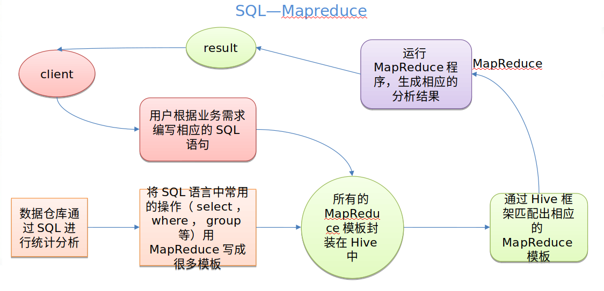

# Hive

Facebook 开源的 用于解决海量***结构化*** 日志的数据统计。基于Hadoop的***数据仓库工具*** 。可以将结构化的数据文件映射为一张表，并提供***类SQL***查询功能。

##### 本质是: 将HQL转化成MapReduce程序



1）Hive处理的数据存储在HDFS

2）Hive分析数据底层的实现是MapReduce

3）执行程序运行在Yarn上


优点

1. 操作接口采用***类SQL语法***，提供快速开发的能力（简单、容易上手）。
2. 避免了去写MapReduce，减少开发人员的学习成本。
3. Hive的***执行延迟比较高***，因此Hive常用于***数据分析***，对实时性要求不高的场合。
4. Hive优势在于***处理大数据***，对于处理小数据没有优势，因为Hive的执行延迟比较高。
5. Hive支持用户***自定义函数***，用户可以根据自己的需求来实现自己的函数。


缺点

1. Hive的HQL表达能力有限

​	（1）迭代式算法无法表达

​	（2）数据挖掘方面不擅长

2. Hive的效率比较低

​	（1）Hive自动生成的MapReduce作业，通常情况下不够智能化

​	（2）Hive调优比较困难，粒度较粗


Hive架构原理


1. 用户接口：Client

   CLI（hive shell）、JDBC/ODBC(java访问hive)、WEBUI（浏览器访问hive）

2. 元数据：Metastore

   元数据包括：表名、表所属的数据库（默认是default）、表的拥有者、列/分区字段、表的类型（是否是外部表）、表的数据所在目录等；

   默认存储在自带的derby数据库中，推荐使用MySQL存储Metastore

3. Hadoop

   使用HDFS进行存储，使用MapReduce进行计算。

4. 驱动器：Driver

   （1）解析器（SQL Parser）：将SQL字符串转换成抽象语法树AST，这一步一般都用第三方工具库完成，比如antlr；对AST进行语法分析，比如表是否存在、字段是否存在、SQL语义是否有误。

   （2）编译器（Physical Plan）：将AST编译生成逻辑执行计划。

   （3）优化器（Query Optimizer）：对逻辑执行计划进行优化。

   （4）执行器（Execution）：把逻辑执行计划转换成可以运行的物理计划。对于Hive来说，就是MR/Spark。


Hive数据的存储

1. Hive要分析的数据是存储在HDFS上
   		hive中的**库**的位置，在hdfs上就是一个**目录**
      		hive中的**表**的位置，在hdfs上也是一个目录，在所在的库目录下创建了一个**子目录**
      		hive中的**数据**，是存在在表**目录中的文件**

2. 在hive中，存储的数据必须是**结构化的数据**，而且
   这个数据的格式要和表的属性紧密相关！
   表在创建时，有分隔符属性，这个分隔符属性，代表在执行MR程序时，使用哪个分隔符去分割每行中的字段

   hive中默认字段的分隔符： ctrl+A, 进入编辑模式，ctrl+V 再ctrl+A

3. hive中的元数据(schema)存储在关系型数据库
   默认存储在derby中！
   derby是使用Java语言编写的一个微型，常用于内嵌在Java中的数据库！
   derby同一个数据库的实例文件不支持多个客户端同时访问！

4. 将hive的元数据的存储设置存储在Mysql中！
   Mysql支持多用户同时访问一个库的信息！

   >注意事项： 
   >
   >①metastore库的字符集必须是latin1
   >②5.5mysql，改 binlog_format=mixed | row 默认为statement mysql的配置文件： /etc/my.cnf


Hive元数据配置到MySQL

1. mysql-connector-java-5.1.27.tar.gz 解压 mysql-connector-java-5.1.27, 把mysql-connector-java-5.1.27目录下的mysql-connector-java-5.1.27-bin.jar拷贝到/opt/module/hive/lib/

2. 配置Metastore到MySQL

   在/opt/module/hive/conf目录下创建一个hive-site.xml

   根据官方文档 拷贝数据到hive-site.xml

   ```xml
   https://cwiki.apache.org/confluence/display/Hive/AdminManual+MetastoreAdmin
   <?xml version="1.0"?>
   <?xml-stylesheet type="text/xsl" href="configuration.xsl"?>
   <configuration>
   	<property>
   	  <name>javax.jdo.option.ConnectionURL</name>
   	  <value>jdbc:mysql://hadoop102:3306/metastore?createDatabaseIfNotExist=true</value>
   	  <description>JDBC connect string for a JDBC metastore</description>
   	</property>
   
   	<property>
   	  <name>javax.jdo.option.ConnectionDriverName</name>
   	  <value>com.mysql.jdbc.Driver</value>
   	  <description>Driver class name for a JDBC metastore</description>
   	</property>
   
   	<property>
   	  <name>javax.jdo.option.ConnectionUserName</name>
   	  <value>root</value>
   	  <description>username to use against metastore database</description>
   	</property>
   
   	<property>
   	  <name>javax.jdo.option.ConnectionPassword</name>
   	  <value>000000</value>
   	  <description>password to use against metastore database</description>
   	</property>
   </configuration>
   ```

   重启虚拟机(别忘了重启hadoop)


HiveJDBC 访问

- 启动hiveserver2 服务:  bin/hiveserver2

- 启动beeline: bin/beeline

- 连接hiveserver2

  ```
  beeline> !connect jdbc:hive2://hadoop102:10000
  ```


Hive常用命令

usage:

hive

- -d --define <key=value> 　Variable subsitution to apply to hive

```shell
-d A=B  or --define A=B
```

定义一个变量，在hive启动后，可以使用${变量名}引用变量	  

--database 　<databasename>     Specify the database to use　指定使用哪个库

-  -e 　<quoted-query-string>     SQL from command line　指定命令行获取的一条引号引起来的sql，执行完返回结果后***退出cli!***

- -f 　<filename>   SQL from files　执行一个文件中的sql语句！执行完返回结果后***退出cli!***
- -H,--help       Print help information

- --hiveconf   <property=value>   Use value for given property 在cli运行之前，定义一对属性

  >hive在运行时，先读取 hadoop的全部8个配置文件，读取之后，再读取hive-default.xml
  >再读取hive-site.xml， 如果使用--hiveconf，可以定义一组属性，这个属性会覆盖之前读到的参数的值！

- --hivevar <key=value>   Variable subsitution to apply to hive
  e.g. --hivevar A=B   作用和-d是一致的！

-  -i    <filename>   Initialization SQL file   先初始化一个sql文件，之后不退出cli
-  -S   --silent   Silent mode in interactive shell   不打印和结果无关的信息
-  -v,  --verbose    Verbose mode (echo executed SQL to the console)


Hive 常见属性配置

- Hive数据仓库位置的配置

1）Default数据仓库的最原始位置是在hdfs上的：/user/hive/warehouse路径下。

2）在仓库目录下，没有对默认的数据库default创建文件夹。如果某张表属于default数据库，直接在数据仓库目录下创建一个文件夹。

3）修改default数据仓库原始位置（将hive-default.xml.template如下配置信息拷贝到hive-site.xml文件中）。

```xml
<property>
	<name>hive.metastore.warehouse.dir</name>
	<value>/user/hive/warehouse</value>
	<description>location of default database for the warehouse</description>
</property>
```

- 查询后信息显示配置

```xml
<property>
	<name>hive.cli.print.header</name>
	<value>true</value>
</property>

<property>
	<name>hive.cli.print.current.db</name>
	<value>true</value>
</property>
```

- Hive 运行日志信息配置

(1) 修改/opt/module/hive/conf/hive-log4j.properties.template文件名称为 hive-log4j.properties

(2) 在hive-log4j.properties文件中修改log存放位置 hive.log.dir=/opt/module/hive/logs


Hive 数据类型

> **STRUCT** 			
>
> 和c语言中的struct类似，都可以通过“点”符号访问元素内容。
>
> 例如，如果某个列的数据类型是STRUCT{first STRING, last STRING},那么第1个元素可以通过字段.first来引用。 	

例子; 

假设某表有如下一行，我们用JSON格式来表示其数据结构。在Hive下访问的格式为

```json
{
    "name": "songsong",
    "friends": ["bingbing" , "lili"] ,       //列表Array, 
    "children": {                      		 //键值Map,
        "xiao song": 18 ,
        "xiaoxiao song": 19
    }
    "address": {                      		//结构Struct,
        "street": "hui long guan" ,
        "city": "beijing" 
    }
}
```

songsong,bingbing_lili,xiao song:18_xiaoxiao song:19,hui long guan_beijing
yangyang,caicai_susu,xiao yang:18_xiaoxiao yang:19,chao yang_beijing

Map和Struct的区别：  Struct中属性名是不变的！
					 					Map中key可以变化的！

> 注意： 在一个表中，array每个元素之间的分隔符和Map每个Entry之间的分隔符和struct每个属性之间的分隔符需要一致！


