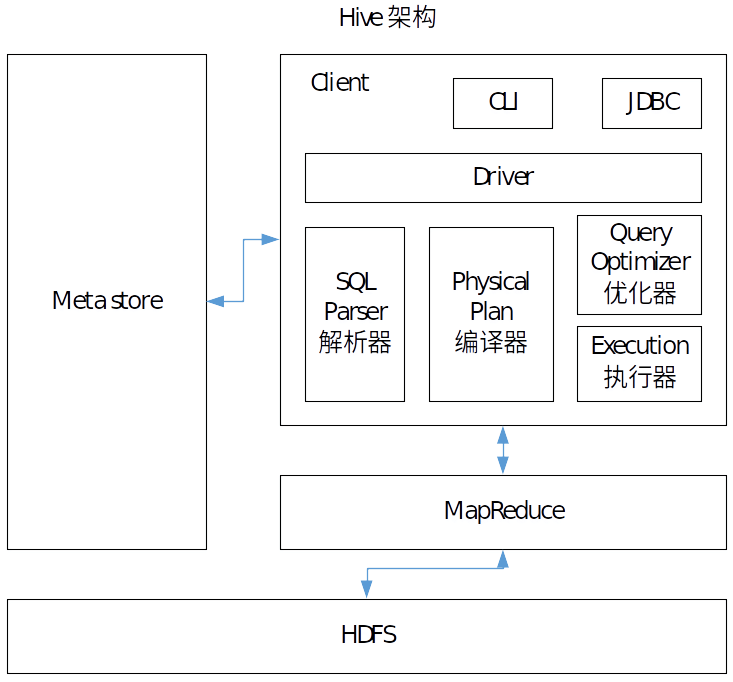
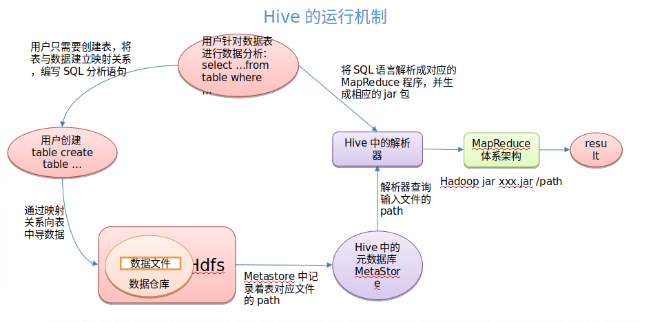

# Hive

Facebook 开源的 用于解决海量***结构化*** 日志的数据统计。基于Hadoop的***数据仓库工具*** 。可以将结构化的数据文件映射为一张表，并提供***类SQL***查询功能。

##### 本质是: 将HQL转化成MapReduce程序


1）Hive处理的数据存储在HDFS

2）Hive分析数据底层的实现是MapReduce

3）执行程序运行在Yarn上


优点

1. 操作接口采用***类SQL语法***，提供快速开发的能力（简单、容易上手）。
2. 避免了去写MapReduce，减少开发人员的学习成本。
3. Hive的***执行延迟比较高***，因此Hive常用于***数据分析***，对实时性要求不高的场合。
4. Hive优势在于***处理大数据***，对于处理小数据没有优势，因为Hive的执行延迟比较高。
5. Hive支持用户***自定义函数***，用户可以根据自己的需求来实现自己的函数。


缺点

1. Hive的HQL表达能力有限

​	（1）迭代式算法无法表达

​	（2）数据挖掘方面不擅长

2. Hive的效率比较低

​	（1）Hive自动生成的MapReduce作业，通常情况下不够智能化

​	（2）Hive调优比较困难，粒度较粗


Hive架构原理



1. 用户接口：Client

   CLI（hive shell）、JDBC/ODBC(java访问hive)、WEBUI（浏览器访问hive）

2. 元数据：Metastore

   元数据包括：表名、表所属的数据库（默认是default）、表的拥有者、列/分区字段、表的类型（是否是外部表）、表的数据所在目录等；

   默认存储在自带的derby数据库中，推荐使用MySQL存储Metastore

3. Hadoop

   使用HDFS进行存储，使用MapReduce进行计算。

4. 驱动器：Driver

   （1）解析器（SQL Parser）：将SQL字符串转换成抽象语法树AST，这一步一般都用第三方工具库完成，比如antlr；对AST进行语法分析，比如表是否存在、字段是否存在、SQL语义是否有误。

   （2）编译器（Physical Plan）：将AST编译生成逻辑执行计划。

   （3）优化器（Query Optimizer）：对逻辑执行计划进行优化。

   （4）执行器（Execution）：把逻辑执行计划转换成可以运行的物理计划。对于Hive来说，就是MR/Spark。



Hive数据的存储

1. Hive要分析的数据是存储在HDFS上
   		hive中的**库**的位置，在hdfs上就是一个**目录**
      		hive中的**表**的位置，在hdfs上也是一个目录，在所在的库目录下创建了一个**子目录**
      		hive中的**数据**，是存在在表**目录中的文件**

2. 在hive中，存储的数据必须是**结构化的数据**，而且
   这个数据的格式要和表的属性紧密相关！
   表在创建时，有分隔符属性，这个分隔符属性，代表在执行MR程序时，使用哪个分隔符去分割每行中的字段

   hive中默认字段的分隔符： ctrl+A, 进入编辑模式，ctrl+V 再ctrl+A

3. hive中的元数据(schema)存储在关系型数据库
   默认存储在derby中！
   derby是使用Java语言编写的一个微型，常用于内嵌在Java中的数据库！
   derby同一个数据库的实例文件不支持多个客户端同时访问！

4. 将hive的元数据的存储设置存储在Mysql中！
   Mysql支持多用户同时访问一个库的信息！

   >注意事项： 
   >
   >①metastore库的字符集必须是latin1
   >②5.5mysql，改 binlog_format=mixed | row 默认为statement mysql的配置文件： /etc/my.cnf


Hive元数据配置到MySQL

1. mysql-connector-java-5.1.27.tar.gz 解压 mysql-connector-java-5.1.27, 把mysql-connector-java-5.1.27目录下的mysql-connector-java-5.1.27-bin.jar拷贝到/opt/module/hive/lib/

2. 配置Metastore到MySQL

   在/opt/module/hive/conf目录下创建一个hive-site.xml

   根据官方文档 拷贝数据到hive-site.xml

   ```xml
   https://cwiki.apache.org/confluence/display/Hive/AdminManual+MetastoreAdmin
   <?xml version="1.0"?>
   <?xml-stylesheet type="text/xsl" href="configuration.xsl"?>
   <configuration>
   	<property>
   	  <name>javax.jdo.option.ConnectionURL</name>
   	  <value>jdbc:mysql://hadoop102:3306/metastore?createDatabaseIfNotExist=true</value>
   	  <description>JDBC connect string for a JDBC metastore</description>
   	</property>
   
   	<property>
   	  <name>javax.jdo.option.ConnectionDriverName</name>
   	  <value>com.mysql.jdbc.Driver</value>
   	  <description>Driver class name for a JDBC metastore</description>
   	</property>
   
   	<property>
   	  <name>javax.jdo.option.ConnectionUserName</name>
   	  <value>root</value>
   	  <description>username to use against metastore database</description>
   	</property>
   
   	<property>
   	  <name>javax.jdo.option.ConnectionPassword</name>
   	  <value>000000</value>
   	  <description>password to use against metastore database</description>
   	</property>
   </configuration>
   ```

   重启虚拟机(别忘了重启hadoop)


HiveJDBC 访问

- 启动hiveserver2 服务:  bin/hiveserver2

- 启动beeline: bin/beeline

- 连接hiveserver2

  ```
  beeline> !connect jdbc:hive2://hadoop102:10000
  ```


Hive常用命令

usage:

hive

- -d --define <key=value> 　Variable subsitution to apply to hive

```shell
-d A=B  or --define A=B
```

定义一个变量，在hive启动后，可以使用${变量名}引用变量	  

--database 　<databasename>     Specify the database to use　指定使用哪个库

-  -e 　<quoted-query-string>     SQL from command line　指定命令行获取的一条引号引起来的sql，执行完返回结果后***退出cli!***

- -f 　<filename>   SQL from files　执行一个文件中的sql语句！执行完返回结果后***退出cli!***
- -H,--help       Print help information

- --hiveconf   <property=value>   Use value for given property 在cli运行之前，定义一对属性

  >hive在运行时，先读取 hadoop的全部8个配置文件，读取之后，再读取hive-default.xml
  >再读取hive-site.xml， 如果使用--hiveconf，可以定义一组属性，这个属性会覆盖之前读到的参数的值！

- --hivevar <key=value>   Variable subsitution to apply to hive
  e.g. --hivevar A=B   作用和-d是一致的！

-  -i    <filename>   Initialization SQL file   先初始化一个sql文件，之后不退出cli
-  -S   --silent   Silent mode in interactive shell   不打印和结果无关的信息
-  -v,  --verbose    Verbose mode (echo executed SQL to the console)


Hive 常见属性配置

- Hive数据仓库位置的配置

1）Default数据仓库的最原始位置是在hdfs上的：/user/hive/warehouse路径下。

2）在仓库目录下，没有对默认的数据库default创建文件夹。如果某张表属于default数据库，直接在数据仓库目录下创建一个文件夹。

3）修改default数据仓库原始位置（将hive-default.xml.template如下配置信息拷贝到hive-site.xml文件中）。

```xml
<property>
	<name>hive.metastore.warehouse.dir</name>
	<value>/user/hive/warehouse</value>
	<description>location of default database for the warehouse</description>
</property>
```

- 查询后信息显示配置

```xml
<property>
	<name>hive.cli.print.header</name>
	<value>true</value>
</property>

<property>
	<name>hive.cli.print.current.db</name>
	<value>true</value>
</property>
```

- Hive 运行日志信息配置

(1) 修改/opt/module/hive/conf/hive-log4j.properties.template文件名称为 hive-log4j.properties

(2) 在hive-log4j.properties文件中修改log存放位置 hive.log.dir=/opt/module/hive/logs


Hive 数据类型

> **STRUCT** 			
>
> 和c语言中的struct类似，都可以通过“点”符号访问元素内容。
>
> 例如，如果某个列的数据类型是STRUCT{first STRING, last STRING},那么第1个元素可以通过字段.first来引用。 	

例子; 

假设某表有如下一行，我们用JSON格式来表示其数据结构。在Hive下访问的格式为

```json
{
    "name": "songsong",
    "friends": ["bingbing" , "lili"] ,       //列表Array, 
    "children": {                      		 //键值Map,
        "xiao song": 18 ,
        "xiaoxiao song": 19
    }
    "address": {                      		//结构Struct,
        "street": "hui long guan" ,
        "city": "beijing" 
    }
}
```

songsong,bingbing_lili,xiao song:18_xiaoxiao song:19,hui long guan_beijing
yangyang,caicai_susu,xiao yang:18_xiaoxiao yang:19,chao yang_beijing

Map和Struct的区别：  Struct中属性名是不变的！
					 					Map中key可以变化的！

> 注意： 在一个表中，array每个元素之间的分隔符和Map每个Entry之间的分隔符和struct每个属性之间的分隔符需要一致！


DDL数据定义

- 数据库
  - 增

    ```sql
    CREATE (DATABASE|SCHEMA) [IF NOT EXISTS] database_name
      [COMMENT database_comment]  // 库的注释说明
      [LOCATION hdfs_path]        // 库在hdfs上的路径
      [WITH DBPROPERTIES (property_name=property_value, ...)]; // 库的属性
    
    create database  if not exists mydb2 
    comment 'this is my db' 
    location 'hdfs://hadoop101:9000/mydb2' 
    with dbproperties('ownner'='jack','tel'='12345','department'='IT');
    ```

  - 删

    ```sql
    drop database 库名： 只能删除空库
    drop database 库名 cascade： 删除非空库 // cascade是级联
    ```

  - 改

    ```sql
    use 库名: 切换
    dbproperties: alter database mydb2 set dbproperties('ownner'='tom','empid'='10001');
    同名的属性值会覆盖，之前没有的属性会新增
    ```

    > 用户可以使用ALTER DATABASE命令为某个数据库的DBPROPERTIES设置键-值对属性值，来描述这个数据库的属性信息.
    >
    > 数据库的其他元数据信息都是不可更改的，包括数据库名和数据库所在的目录位置。

  - 查

    ```sql
    show databases: 查看当前所有的库
    show tables in database: 查看库中所有的表
    desc database 库名： 查看库的描述信息
    desc database extended 库名： 查看库的详细描述信息
    ```

- 数据表

  - 增

    ```sql
    CREATE [EXTERNAL] TABLE [IF NOT EXISTS] table_name 
    [(col_name data_type [COMMENT col_comment], ...)]   //表中的字段信息
    [COMMENT table_comment] //表的注释
    
    [PARTITIONED BY (col_name data_type [COMMENT col_comment], ...)] 
    [CLUSTERED BY (col_name, col_name, ...) 
    [SORTED BY (col_name [ASC|DESC], ...)] INTO num_buckets BUCKETS] 
    
    [ROW FORMAT row_format]  // 表中数据每行的格式，定义数据字段的分隔符，集合元素的分隔符等
    
    [STORED AS file_format] //表中的数据要以哪种文件格式来存储，默认为TEXTFILE（文本文件）可以设置为SequnceFile或 Paquret,ORC等
    
    [LOCATION hdfs_path]  //表在hdfs上的位置
    ```

    ***建表时，不带EXTERNAL，创建的表是一个MANAGED_TABLE(管理表，内部表)***
    ***建表时，带EXTERNAL，创建的表是一个外部表！***

    > Hive创建***内部表*** 时，会将数据移动到***数据仓库*** 指向的路径；
    >
    > 若创建外部表，仅记录数据所在的路径，不对数据的位置做任何改变
    >
    > ***在删除表的时候，内部表的元数据和数据会被一起删除，而外部表只删除元数据，不删除数据。***

  - 删

    ```sql
    drop table 表名：删除表
    ```

  - 改

  - 查

    ```sql
    desc  表名： 查看表的描述
    desc formatted 表名： 查看表的详细描述
    ```


分区表

```sql
[PARTITIONED BY (col_name data_type [COMMENT col_comment], ...)] 
```

- 分区表

  在建表时，指定了PARTITIONED BY ，这个表称为分区表

- 分区概念

  MR：在MapTask输出key-value时，为每个key-value计算一个区号。

  同一个分区的数据，会被同一个reduceTask处理这个分区的数据，最终生成一个结果文件！

  >	通过分区，将MapTask输出的key-value经过reduce后，分散到多个不同的结果文件中！
  >	Hive:  将表中的数据，分散到表目录下的多个子目录(分区目录)中
  >

- 分区意义

  分区的目的是为了就数据，分散到多个子目录中，在执行查询时，可以只选择查询某些子目录中的数据，加快查询效率！

  只有分区表才有子目录(分区目录)
  分区目录的名称由两部分确定：  分区列列名=分区列列值

  将输入导入到指定的分区之后，数据会附加上分区列的信息！
  分区的最终目的是在查询时，使用分区列进行过滤！


分区表的操作

- 创建分区表

  ```sql
  create external table if not exists default.deptpart1(
  deptno int,
  dname string,
  loc int
  )
  PARTITIONED BY(area string)
  row format delimited fields terminated by '\t';
  ```

  ```sql
  create external table if not exists default.deptpart2(
  deptno int,
  dname string,
  loc int
  )
  PARTITIONED BY(area string)
  row format delimited fields terminated by '\t'
  location 'hdfs://hadoop101:9000/deptpart3';
  ```

  多级分区表，有多个分区字段

  ```sql
  create external table if not exists default.deptpart3(
  deptno int,
  dname string,
  loc int
  )
  PARTITIONED BY(area string,province string)
  row format delimited fields terminated by '\t';
  ```

- 分区的查询

  show partitions 表名

- 创建分区

  ① alter table 表名 add partition(分区字段名=分区字段值) ;
  	a)在hdfs上生成分区路径
  	b)在mysql中metastore.partitions表中生成分区的元数据

  ② 直接使用load命令向分区加载数据，如果分区不存在，load时自动帮我们生成分区

  ③ 如果数据已经按照规范的格式，上传到了HDFS，可以使用修复分区命令自动生成分区的元数据
  	msck repair table 表名;

  > 注意事项：
  > ①如果表是个分区表，在导入数据时，必须指定向哪个分区目录导入数据
  > ②如果表是多级分区表，在导入数据时，数据必须位于最后一级分区的目录


分桶表

- 建表

  ```sql
  create table stu_buck(id int, name string)
  clustered by(id) 
  SORTED BY (id desc)
  into 4 buckets
  row format delimited fields terminated by '\t';
  ```

  临时表

  ```sql
  create table stu_buck_tmp(id int, name string)
  row format delimited fields terminated by '\t';
  ```

- 导入数据

  向分桶表导入数据时，必须运行MR程序，才能实现分桶操作。load的方式，只是执行put操作，无法满足分桶表导入数据，必须执行insert into。 
  ***insert into 表名 values(),(),(),()***
  ***insert into 表名 select 语句***

  >导入数据之前：
  >需要打开强制分桶开关： set hive.enforce.bucketing=true;
  >需要打开强制排序开关： set hive.enforce.sorting=true;	
  >insert into table stu_buck select * from stu_buck_tmp

- 抽样查询

**select * from 分桶表 tablesample(bucket x out of y on 分桶表分桶字段);**
说明：

1. 抽样查询的表必须是分桶表！

2. bucket x out of y on 分桶表分桶字段
   假设当前表一共分了z个桶
   x:   从当前表的第几桶开始抽样 0<x<=y
   y:    z/y 代表一共抽多少桶 要求y必须是z的因子或倍数

3. 怎么抽： 从第x桶开始抽样，每间隔y桶抽一桶，知道抽满 z/y桶

   bucket 1 out of 2 on id：  从第1桶(0号桶)开始抽，抽第x+y*(n-1)，一共抽2桶   ： 0号桶,2号桶

4. select * from stu_buck tablesample(bucket 1 out of 2 on id)

   *bucket 1 out of 1 on id：  从第1桶(0号桶)开始抽，抽第x+y*(n-1)，一共抽4桶   ： 0号桶,2号桶,1号桶,3号桶

   bucket 2 out of 4 on id：  从第2桶(1号桶)开始抽，一共抽1桶   ： 1号桶

   bucket 2 out of 8 on id：  从第2桶(1号桶)开始抽，一共抽0.5桶   ： 1号桶的一半


DML导入

- Load: 作用将数据直接加载到表目录中

  ```sql
  load  data [local] inpath 'xx' into table 表名 partition()
  ```

  > local:  如果导入的文件在本地文件系统，需要加上local，使用***put***将本地上传到hdfs.
  >
  > 不加local默认导入的文件是在hdfs，使用***mv***将源文件移动到目标目录.

- insert： insert方式运行MR程序，通过程序将数据输出到表目录

  在某些场景，必须使用insert方式来导入数据：

  1. 向分桶表插入数据
  2. 如果指定表中的数据，不是以纯文本形式存储，需要使用insert方式导入

  ```sql
  insert into|overwrite table 表名 select xxx | values(),(),() 
  insert into: 向表中追加新的数据
  insert overwrite： 先清空表中所有的数据，再向表中添加新的数据
  ```

  > 注意:
  >
  > 多插入模式(从一张源表查询，向多个目标表插入)
  > from 源表
  > insert xxxx  目标表  select xxx
  > insert xxxx  目标表  select xxx
  > insert xxxx  目标表  select xxx		
  >
  >  insert into table deptpart1 partition(area='huaxi') select deptno,dname,loc
  >  insert into table deptpart1 partition(area='huaxinan') select deptno,dname,loc 

  location: 在建表时，指定表的location为数据存放的目录

  import :  不仅可以导入***数据***还可以顺便导入元数据(表***结构***)。Import只能导入export输出的内容！

  ```sql
  IMPORT [[EXTERNAL] TABLE 表名(新表或已经存在的表) [PARTITION (part_column="value"[, ...])]]
  FROM 'source_path'
  [LOCATION 'import_target_path']
  ```

  1. 如果向一个新表中导入数据，hive会根据要导入表的元数据自动创建表
  2. 如果向一个已经存在的表导入数据，在导入之前会先检查表的结构和属性是否一致, 只有在表的结构和属性一致时，才会执行导入
  3. 不管表是否为空，要导入的分区必须是不存在的
      import external table importtable1  from '/export1'


DML导出

- insert: 将一条sql运算的结果，插入到指定的路径

  ```sql
  insert overwrite [local] directory '/opt/module/datas/export/student'
  row format xxxx
  select * from student;
  ```

- export: 既能导出数据，还可以导出元数据(表结构)

  ```sql
  export table 表名 [partiton(分区信息) ] to 'hdfspath'
  ```

  export会在hdfs的导出目录中，生成数据和元数据, 导出的元数据是和RDMS无关. 如果是分区表，可以选择将分区表的部分分区进行导出


排序

Hive的本质是MR，MR中如何排序的

> 排序： 在reduce之前就已经排好序了，排序是shuffle阶段的主要工作
> 分区：使用Partitioner来进行分区
> 当reduceTaskNum>1，设置用户自己定义的分区器，如果没有使用HashParitioner!
> HashParitioner只根据key的hashcode来分区！

- 全排序：  结果只有一个(只有一个分区)，所有的数据整体有序 ORDER BY col_list 
- 部分排序：  结果有多个(有多个分区)，每个分区内部有序 SORT BY col_list
- 二次排序：  在排序时，比较的条件有多个


函数

- 查看函数
  	函数有库的概念，系统提供的除外，系统提供的函数可以在任意库使用！
  	查看当前库所有的函数：show functions;
  	查看函数的使用： desc function 函数名
  	查看函数的详细使用： desc function extended 函数名

- 函数的分类
  函数的来源： 

  ①系统函数，自带的，直接使用即可
  ②用户自定义的函数。
  a)遵守hive函数类的要求，自定义一个函数类
  b)打包函数，放入到hive的lib目录下，或在HIVE_HOME/auxlib
  auxlib用来存放hive可以加载的第三方jar包的目录
  c)创建一个函数，让这个函数和之前编写的类关联
  函数有库的概念
  d)使用函数

  函数按照特征分：   

  ①UDF： 用户定义的函数。 一进一出。 输入单个参数，返回单个结果！cast('a' as int) 返回 null	  

  ②UDTF:  用户定义的表生成函数。 一进多出。传入一个参数(集合类型)，返回一个结果集！

  ③UDAF： 用户定义的聚集函数。 多进一出。 传入一列多行的数据，返回一个结果(一列一行) count,avg,sum

  > // 按照科目进行排名
  > // 给每个学生的总分进行排名
  > // 只查询每个科目的成绩的前2名
  > //查询学生成绩，并显示当前科目最高分
  > //查询学生成绩，并显示当前科目最低分
  >
  >
  > 常用日期函数
  > 		hive默认解析的日期必须是： 2019-11-24 08:09:10
  > unix_timestamp:返回当前或指定时间的时间戳	
  > from_unixtime：将时间戳转为日期格式
  > current_date：当前日期
  > current_timestamp：当前的日期加时间
  >
  > * to_date：抽取日期部分
  >   year：获取年
  >   month：获取月
  >   day：获取日
  >   hour：获取时
  >   minute：获取分
  >   second：获取秒
  >   weekofyear：当前时间是一年中的第几周
  >   dayofmonth：当前时间是一个月中的第几天
  > * months_between： 两个日期间的月份，前-后
  > * add_months：日期加减月
  > * datediff：两个日期相差的天数，前-后
  > * date_add：日期加天数
  > * date_sub：日期减天数
  > * last_day：日期的当月的最后一天
  >
  > date_format格式化日期   date_format( 2019-11-24 08:09:10,'yyyy-MM') mn
  >
  > *常用取整函数
  > round： 四舍五入
  > ceil：  向上取整
  > floor： 向下取整
  >
  > 常用字符串操作函数
  > upper： 转大写
  > lower： 转小写
  > length： 长度
  >
  > * trim：  前后去空格
  >   lpad： 向左补齐，到指定长度
  >   rpad：  向右补齐，到指定长度
  > * regexp_replace： SELECT regexp_replace('100-200', '(\d+)', 'num')='num-num
  >   使用正则表达式匹配目标字符串，匹配成功后替换！
  >
  > 集合操作
  > size： 集合（map和list）中元素的个数
  > map_keys： 返回map中的key
  > map_values: 返回map中的value
  >
  > * array_contains: 判断array中是否包含某个元素
  >   sort_array： 将array中的元素排序
  >


