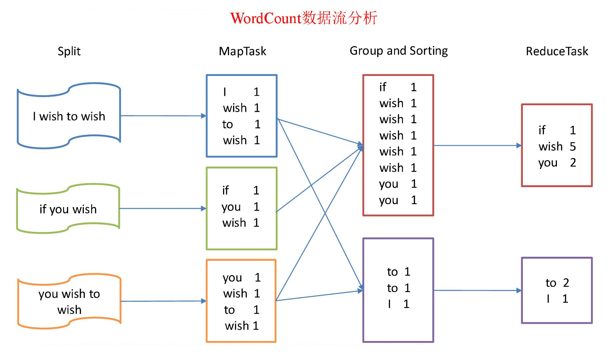
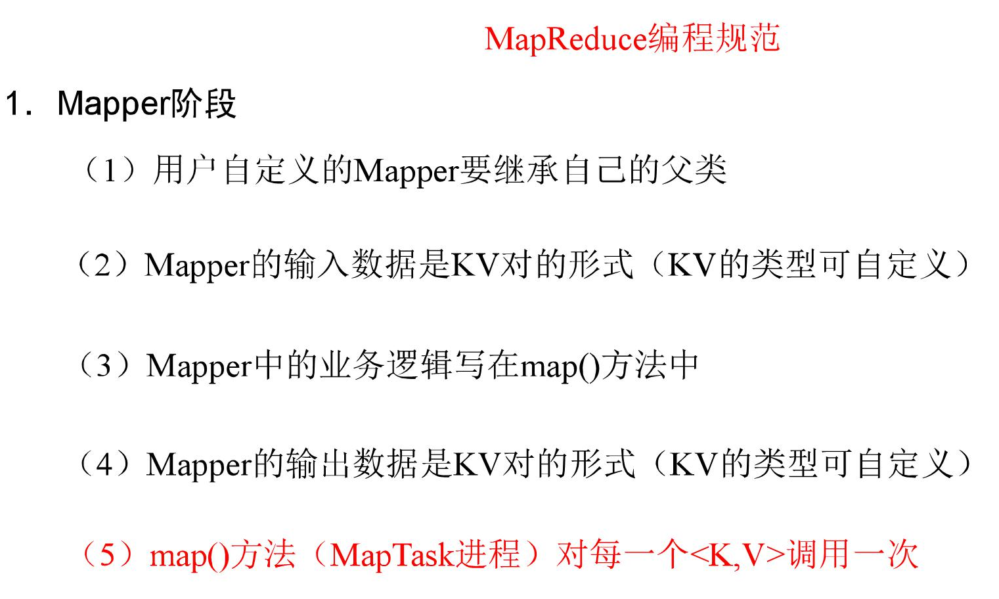
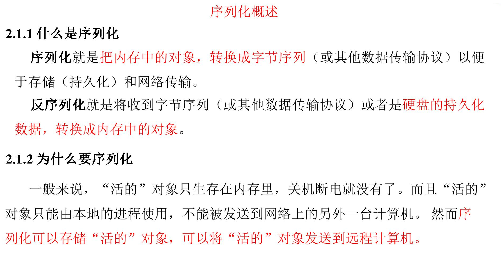
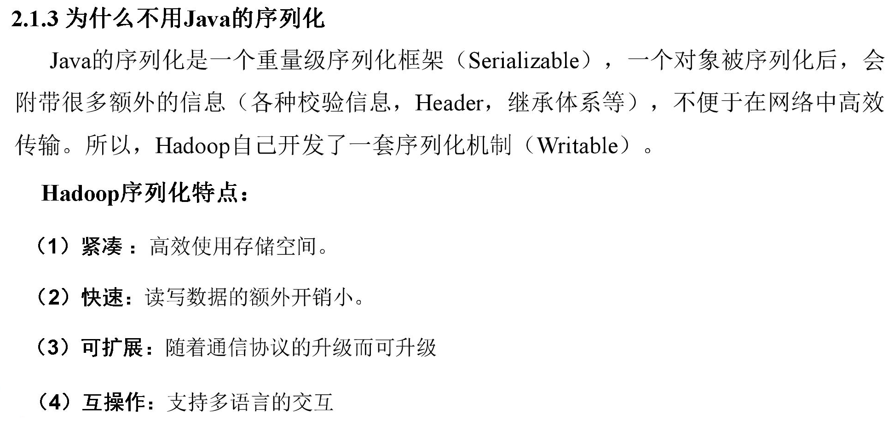
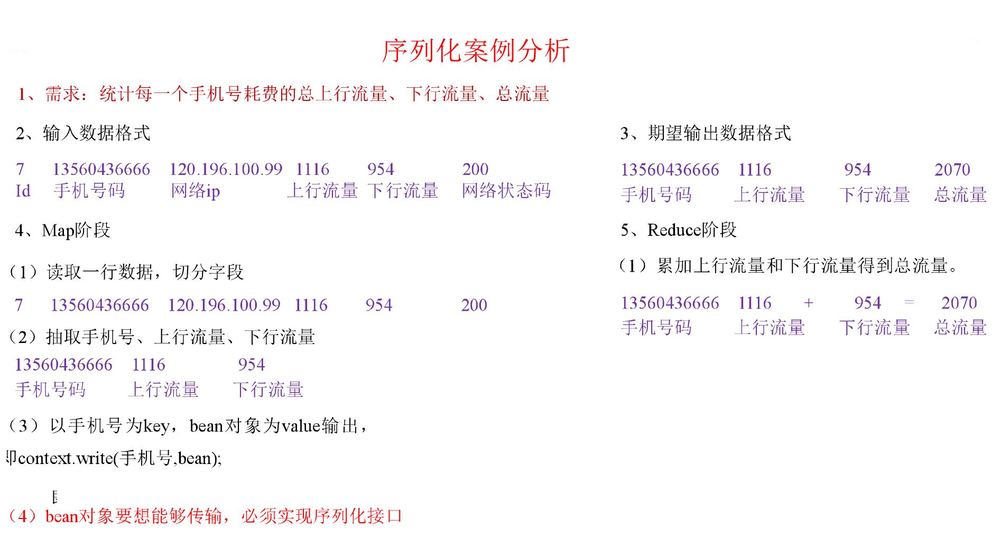
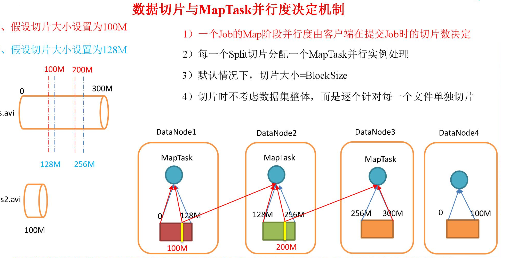

### MapReduce

一个分布式**运算程序**的程序框架 基于Hadoop的**数据的分析应用** 的核心框架

- 核心功能: 将用户的**业务逻辑**代码 和 自带的**默认组件** 整合成一个完整的**分布式运算程序** 并运行在一个Hadoop集群上

- 优点: 1) 易于编程 2) 扩展性好 3) 容错性高 4) 适合PB级别以上海量数据的离线处理 

  缺点: 1) 不可以进行实时计算 2) 不擅长流式计算 3) 不擅长DAG(有向图)计算

- 编程思想

  

  WordCount 数据流走向

  

  MapReduce 进程

  

- MapReduce 的编程规范

  用户编写的程序分为Mapper Reducer Driver

  

  

- WordCount 实例

  统计文本中每个单词出现的总次数

  

  - Mapper

  ```java
  	package com.atguigu.mr.wordcount;
  
  import java.io.IOException;
  import java.util.List;
  
  import org.apache.hadoop.io.IntWritable;
  import org.apache.hadoop.io.LongWritable;
  import org.apache.hadoop.io.Text;
  import org.apache.hadoop.mapreduce.InputSplit;
  import org.apache.hadoop.mapreduce.Mapper;
  import org.apache.hadoop.mapreduce.RecordReader;
  
  /*
   * 注意：导包时，导入 org.apache.hadoop.mapreduce包下的类(2.0的新api)
   * 
   * 1. 自定义的类必须复合MR的Mapper的规范
   * 
   * 2.在MR中，只能处理key-value格式的数据
   * 	 KEYIN, VALUEIN： mapper输入的k-v类型。 由当前Job的InputFormat的RecordReader决定！
   * 		封装输入的key-value由RR自动进行。
   * 
   *   KEYOUT, VALUEOUT： mapper输出的k-v类型: 自定义
   *   
   *  3. InputFormat的作用：
   *  		①验证输入目录中文件格式，是否符合当前Job的要求
   *  		②生成切片，每个切片都会交给一个MapTask处理
   *  		③提供RecordReader，由RR从切片中读取记录，交给Mapper进行处理
   *  
   *  	方法： List<InputSplit> getSplits： 切片
   *  		RecordReader<K,V> createRecordReader： 创建RR
   *  
   *  	默认hadoop使用的是TextInputFormat，TextInputFormat使用LineRecordReader!
   *  
   *  4. 在Hadoop中，如果有Reduce阶段。通常key-value都需要实现序列化协议！
   *  		
   *  			MapTask处理后的key-value，只是一个阶段性的结果！
   *  			这些key-value需要传输到ReduceTask所在的机器！
   *  			将一个对象通过序列化技术，序列化到一个文件中，经过网络传输到另外一台机器，
   *  			再使用反序列化技术，从文件中读取数据，还原为对象是最快捷的方式！
   *  
   *  	java的序列化协议： Serilizxxxxx
   *  			特点：不仅保存对象的属性值，类型，还会保存大量的包的结构，子父类和接口的继承信息！
   *  				重
   *  	hadoop开发了一款轻量级的序列化协议： Wriable机制！
   */
  public class WCMapper extends Mapper<LongWritable, Text, Text, IntWritable>{
  	
  	private Text out_key=new Text();
  	private IntWritable out_value=new IntWritable(1);
  	
  	// 针对输入的每个 keyin-valuein调用一次   （0，hello	hi	hello	hi）
  	@Override
  	protected void map(LongWritable key, Text value, Mapper<LongWritable, Text, Text, IntWritable>.Context context)
  			throws IOException, InterruptedException {
  	
  		System.out.println("keyin:"+key+"----keyout:"+value);
  		
  		String[] words = value.toString().split("\t");
  		
  		for (String word : words) {
  			
  			out_key.set(word);
  			
  			//写出数据(单词,1)
  			context.write(out_key, out_value);
  			
  		}	
  	}
  }
  ```

  - Reducer

  ```java
  package com.atguigu.mr.wordcount;
  
  import java.io.IOException;
  
  import org.apache.hadoop.io.IntWritable;
  import org.apache.hadoop.io.Text;
  import org.apache.hadoop.mapreduce.Reducer;
  
  /*
   * 1. Reducer需要复合Hadoop的Reducer规范
   * 
   * 2. KEYIN, VALUEIN: Mapper输出的keyout-valueout
   * 	  KEYOUT, VALUEOUT: 自定义
   */		
  public class WCReducer extends Reducer<Text, IntWritable, Text, IntWritable>{
  	
  	private IntWritable out_value=new IntWritable();
  	
  	// reduce一次处理一组数据，key相同的视为一组
  	@Override
  	protected void reduce(Text key, Iterable<IntWritable> values,
  			Reducer<Text, IntWritable, Text, IntWritable>.Context context) throws IOException, InterruptedException {
  		int sum=0;
  		for (IntWritable intWritable : values) {
  			sum+=intWritable.get();
  		}
  		out_value.set(sum);
  		//将累加的值写出
  		context.write(key, out_value);
  	}
  }
  ```

  - Driver

  ```java
  package com.atguigu.mr.wordcount;
  
  import java.io.IOException;
  import java.net.URI;
  
  import org.apache.hadoop.conf.Configuration;
  import org.apache.hadoop.fs.FileSystem;
  import org.apache.hadoop.fs.Path;
  import org.apache.hadoop.io.IntWritable;
  import org.apache.hadoop.io.Text;
  import org.apache.hadoop.mapreduce.Job;
  import org.apache.hadoop.mapreduce.lib.input.FileInputFormat;
  import org.apache.hadoop.mapreduce.lib.output.FileOutputFormat;
  
  /*
   * 1.一旦启动这个线程，运行Job
   * 
   * 2.本地模式主要用于测试程序是否正确！
   * 
   * 3. 报错：
   * 	  ExitCodeException exitCode=1: /bin/bash: line 0: fg: no job control
   */
  public class WCDriver {
  	
  	public static void main(String[] args) throws Exception {
  		
  		Path inputPath=new Path("e:/mrinput/wordcount");
  		Path outputPath=new Path("e:/mroutput/wordcount");
  		
  		/*Path inputPath=new Path("/wordcount");
  		Path outputPath=new Path("/mroutput/wordcount");*/
  		
  		//作为整个Job的配置
  		Configuration conf = new Configuration();
  		
  		/*conf.set("fs.defaultFS", "hdfs://hadoop101:9000");
  		
  		// 在YARN上运行
  		conf.set("mapreduce.framework.name", "yarn");
  		// RM所在的机器
  		conf.set("yarn.resourcemanager.hostname", "hadoop102");*/
  		
  		//保证输出目录不存在
  		FileSystem fs=FileSystem.get(conf);
  		
  		if (fs.exists(outputPath)) {
  			fs.delete(outputPath, true);
  		}
  		
  		// ①创建Job
  		Job job = Job.getInstance(conf);
  		
  		// 告诉NM运行时，MR中Job所在的Jar包在哪里
  		//job.setJar("MapReduce-0.0.1-SNAPSHOT.jar");
  		// 将某个类所在地jar包作为job的jar包
  		job.setJarByClass(WCDriver.class);
  		
  		// 为Job创建一个名字
  		job.setJobName("wordcount");
  		
  		// ②设置Job
  		// 设置Job运行的Mapper，Reducer类型，Mapper,Reducer输出的key-value类型
  		job.setMapperClass(WCMapper.class);
  		job.setReducerClass(WCReducer.class);
  		
  		// Job需要根据Mapper和Reducer输出的Key-value类型准备序列化器，通过序列化器对输出的key-value进行序列化和反序列化
  		// 如果Mapper和Reducer输出的Key-value类型一致，直接设置Job最终的输出类型
  		job.setOutputKeyClass(Text.class);
  		job.setOutputValueClass(IntWritable.class);
  		
  		// 设置输入目录和输出目录
  		FileInputFormat.setInputPaths(job, inputPath);
  		FileOutputFormat.setOutputPath(job, outputPath);
  		
  		// ③运行Job
  		job.waitForCompletion(true);
  	}
  }
  ```

- 序列化

  

  

  常用的序列化类型: 

  | Java 类型  | Hadoop Writable 类型 |
  | ---------- | -------------------- |
  | boolean    | BooleanWritable      |
  | byte       | ByteWritable         |
  | int        | IntWritable          |
  | float      | FloatWritable        |
  | long       | LongWritable         |
  | double     | DoubleWritable       |
  | **String** | **Text**             |
  | map        | MapWritable          |
  | array      | ArrayWritable        |

   

  自定义bean 对象实现序列化接口(Wirtable)

  > 共需要七个步骤

  1. 实现Writable 接口

  2. 有空参构造(反序列化时 需要反射调用空参构造函数)

     ```java
     public FlowBean() {
     	super();
     }
     ```

  3. 重写序列化方法

     ```java
     @Override
     public void write(DataOutput out) throws IOException {
     	out.writeLong(upFlow);
     	out.writeLong(downFlow);
     	out.writeLong(sumFlow);
     }
     ```

  4. 重写反序列化方法

     ```java
     @Override
     public void readFields(DataInput in) throws IOException {
     	upFlow = in.readLong();
     	downFlow = in.readLong();
     	sumFlow = in.readLong();
     }
     ```

  5.  注意反序列化的顺序和序列化的顺序完全一致

  6.  要想把结果显示在文件中,需要重写 toString(),可用”\t”分开,方便后续用。

  7. 如果需要将自定义的 bean 放在 key 中传输,则还需要实现 Comparable 接口,因为 MapReduce 框中的 Shuffle 过程要求对 key 必须能排序。

     ```java
     @Override
     public int compareTo(FlowBean o) {
     	// 倒序排列,从大到小
     	return this.sumFlow > o.getSumFlow() ? -1 : 1;
     }
     ```

  

  序列化实例

  

  - FlowBean 对象

    ```java
    package com.abelrose.mr.flowbean;
    
    import java.io.DataInput;
    import java.io.DataOutput;
    import java.io.IOException;
    
    import org.apache.hadoop.io.Writable;
    
    public class FlowBean implements Writable{
    	
    	private long upFlow; // 上行流量
    	private long downFlow; // 下行流量
    	private long sumFlow; // 总流量
    	
    	public FlowBean() {
    	}
    
    	public long getUpFlow() {
    		return upFlow;
    	}
    
    	public void setUpFlow(long upFlow) {
    		this.upFlow = upFlow;
    	}
    
    	public long getDownFlow() {
    		return downFlow;
    	}
    
    	public void setDownFlow(long downFlow) {
    		this.downFlow = downFlow;
    	}
    
    	public long getSumFlow() {
    		return sumFlow;
    	}
    
    	public void setSumFlow(long sumFlow) {
    		this.sumFlow = sumFlow;
    	}
    
    	// 序列化 在写出属性时，如果为引用数据类型，属性不能为null
    	@Override
    	public void write(DataOutput out) throws IOException {
    		out.writeLong(upFlow);
    		out.writeLong(downFlow);
    		out.writeLong(sumFlow);
    	}
    
    	//反序列化 序列化和反序列化的顺序要一致
    	@Override
    	public void readFields(DataInput in) throws IOException {
    		upFlow=in.readLong();
    		downFlow=in.readLong();
    		sumFlow=in.readLong();
    		
    	}
    
    	@Override
    	public String toString() {
    		return  upFlow + "\t" + downFlow + "\t" + sumFlow;
    	}
    }
    ```

  - FlowBeanDriver

    ```java
    package com.abelrose.mr.flowbean;
    
    import java.io.IOException;
    import java.net.URI;
    
    import org.apache.hadoop.conf.Configuration;
    import org.apache.hadoop.fs.FileSystem;
    import org.apache.hadoop.fs.Path;
    import org.apache.hadoop.io.IntWritable;
    import org.apache.hadoop.io.Text;
    import org.apache.hadoop.mapreduce.Job;
    import org.apache.hadoop.mapreduce.lib.input.FileInputFormat;
    import org.apache.hadoop.mapreduce.lib.output.FileOutputFormat;
    
    /*
     * 1.一旦启动这个线程，运行Job
     * 
     * 2.本地模式主要用于测试程序是否正确！
     * 
     * 3.报错：
     * 	 ExitCodeException exitCode=1: /bin/bash: line 0: fg: no job control
     */
    public class FlowBeanDriver {
    	
    	public static void main(String[] args) throws Exception {
    		Path inputPath = new Path("e:/mrinput/flowbean");
    		Path outputPath = new Path("e:/mroutput/flowbean");
    		//作为整个Job的配置
    		Configuration conf = new Configuration();
    		//保证输出目录不存在
    		FileSystem fs=FileSystem.get(conf);
    		
    		if (fs.exists(outputPath)) {
    			fs.delete(outputPath, true);
    		}
    		
    		// ①创建Job
    		Job job = Job.getInstance(conf);
    		
    		// ②设置Job
    		// 设置Job运行的Mapper，Reducer类型，Mapper,Reducer输出的key-value类型
    		job.setMapperClass(FlowBeanMapper.class);
    		job.setReducerClass(FlowBeanReducer.class);
    		
    		// Job需要根据Mapper和Reducer输出的Key-value类型准备序列化器，通过序列化器对输出的key-value进行序列化和反序列化
    		// 如果Mapper和Reducer输出的Key-value类型一致，直接设置Job最终的输出类型
    		job.setOutputKeyClass(Text.class);
    		job.setOutputValueClass(FlowBean.class);
    		
    		// 设置输入目录和输出目录
    		FileInputFormat.setInputPaths(job, inputPath);
    		FileOutputFormat.setOutputPath(job, outputPath);
    		
    		// ③运行Job
    		job.waitForCompletion(true);
    	}
    }
    ```

  - FlowBeanMapper

    ```java
    package com.abelrose.mr.flowbean;
    
    import java.io.IOException;
    
    import org.apache.hadoop.io.LongWritable;
    import org.apache.hadoop.io.Text;
    import org.apache.hadoop.mapreduce.Mapper;
    
    /*
     * 1. 统计手机号(String)的上行(long,int)，下行(long,int)，总流量(long,int)
     * 手机号为key,Bean{上行(long,int)，下行(long,int)，总流量(long,int)}为value
     */
    public class FlowBeanMapper extends Mapper<LongWritable, Text, Text, FlowBean>{
    	
    	private Text out_key=new Text();
    	private FlowBean out_value=new FlowBean();
    	
    	// (0,1	13736230513	192.196.100.1	www.atguigu.com	2481	24681	200)
    	@Override
    	protected void map(LongWritable key, Text value, Mapper<LongWritable, Text, Text, FlowBean>.Context context)throws IOException, InterruptedException {
    		
    		String[] words = value.toString().split("\t");
    		
    		//封装手机号
    		out_key.set(words[1]);
    		// 封装上行
    		out_value.setUpFlow(Long.parseLong(words[words.length-3]));
    		// 封装下行
    		out_value.setDownFlow(Long.parseLong(words[words.length-2]));
    		context.write(out_key, out_value);
    	}
    }
    ```

  - FlowBeanReducer

    ```java
    package com.atgugiu.mr.flowbean;
    
    import java.io.IOException;
    
    import org.apache.hadoop.io.Text;
    import org.apache.hadoop.mapreduce.Reducer;
    
    public class FlowBeanReducer extends Reducer<Text, FlowBean, Text, FlowBean>{
    	
    	private FlowBean out_value=new FlowBean();
    	
    	@Override
    	protected void reduce(Text key, Iterable<FlowBean> values, Reducer<Text, FlowBean, Text, FlowBean>.Context context)
    			throws IOException, InterruptedException {
    		
    		long sumUpFlow=0;
    		long sumDownFlow=0;
    		
    		for (FlowBean flowBean : values) {
    			
    			sumUpFlow+=flowBean.getUpFlow();
    			sumDownFlow+=flowBean.getDownFlow();
    			
    		}
    		
    		out_value.setUpFlow(sumUpFlow);
    		out_value.setDownFlow(sumDownFlow);
    		out_value.setSumFlow(sumDownFlow+sumUpFlow);
    		
    		context.write(key, out_value);
    	}
    }
    ```

- MapReduce 工作流程和原理

  

  

  > 缓冲区的大小可以通过参数调整,参数:io.sort.mb 默认 100M。

- InputFormat 数据输入

  - 切片与MapTask并行度决定机制

    

    数据块: Block 是 HDFS 物理上把数据分成一块一块

    数据切片: 数据切片只是在逻辑上对输入进行分片,并不会在磁盘上将其切分成片进行

  - Job 提交流程源码分析

    

    一、切片

    1. FileInputFormat的切片策略(默认)

    ```java
    public List<InputSplit> getSplits(JobContext job) throws IOException {
    StopWatch sw = new StopWatch().start();
    	// minSize从mapreduce.input.fileinputformat.split.minsize和1之间对比，取最大值
    	long minSize = Math.max(getFormatMinSplitSize(), getMinSplitSize(job));
    	// 读取mapreduce.input.fileinputformat.split.maxsize，如果没有设置使用Long.MaxValue作为默认值
        long maxSize = getMaxSplitSize(job);
        // generate splits
    	List<InputSplit> splits = new ArrayList<InputSplit>();
    	// 获取当前Job输入目录中所有文件的状态(元数据)
    	List<FileStatus> files = listStatus(job);
    	// 以文件为单位进行切片
        for (FileStatus file: files) {
          Path path = file.getPath();
          long length = file.getLen();
          if (length != 0) {
            BlockLocation[] blkLocations;
            if (file instanceof LocatedFileStatus) {
              blkLocations = ((LocatedFileStatus) file).getBlockLocations();
            } else {
              FileSystem fs = path.getFileSystem(job.getConfiguration());
              blkLocations = fs.getFileBlockLocations(file, 0, length);
            }
          // 判断当前文件是否可切，如果可切，切片
            if (isSplitable(job, path)) {
              long blockSize = file.getBlockSize();
              long splitSize = computeSplitSize(blockSize, minSize, maxSize);
               // 声明待切部分数据的余量
              long bytesRemaining = length;
    	// 如果 待切部分 / 片大小  > 1.1，先切去一片，再判断
              while (((double) bytesRemaining)/splitSize > SPLIT_SLOP) {
                int blkIndex = getBlockIndex(blkLocations, length-bytesRemaining);
                splits.add(makeSplit(path, length-bytesRemaining, splitSize,
                            blkLocations[blkIndex].getHosts(),
                            blkLocations[blkIndex].getCachedHosts()));
                bytesRemaining -= splitSize;
              }
    	// 否则，将剩余部分整个作为1片。 最后一片有可能超过片大小，但是不超过其1.1倍
              if (bytesRemaining != 0) {
                int blkIndex = getBlockIndex(blkLocations, length-bytesRemaining);
                splits.add(makeSplit(path, length-bytesRemaining, bytesRemaining,
                           blkLocations[blkIndex].getHosts(),
                           blkLocations[blkIndex].getCachedHosts()));
              }
            } else { // not splitable
             // 如果不可切，整个文件作为1片！
              splits.add(makeSplit(path, 0, length, blkLocations[0].getHosts(),
                          blkLocations[0].getCachedHosts()));
            }
          } else { 
            //Create empty hosts array for zero length files
    	// 如果文件是个空文件，创建一个切片对象，这个切片从当前文件的0offset起，向后读取0个字节
            splits.add(makeSplit(path, 0, length, new String[0]));
          }
        }
        // Save the number of input files for metrics/loadgen
        job.getConfiguration().setLong(NUM_INPUT_FILES, files.size());
        sw.stop();
        if (LOG.isDebugEnabled()) {
          LOG.debug("Total # of splits generated by getSplits: " + splits.size()
              + ", TimeTaken: " + sw.now(TimeUnit.MILLISECONDS));
        }
        return splits;
      }
    ```

    总结： 

    ①获取当前输入目录中所有的文件

    ②以文件为单位切片，如果文件为空文件，默认创建一个空的切片

    ③如果文件不为空，尝试判断文件是否可切(不是压缩文件，都可切)

    ④如果文件不可切，整个文件作为1片

    ⑤如果文件可切，先获取片大小(默认等于块大小)，

    循环判断 待切部分/ 片大小 > 1.1倍，如果大于先切去一片，再判断…

    ⑥剩余部分整个作为1片

    

    2. 从Job的配置中获取参数

    job.getConfiguration().getLong(SPLIT_MINSIZE, 1L)

    指从配置文件中获取名称为SPLIT_MINSIZE的参数，如果获取到，将参数的值返回，否则就使用默认1L！

    设置Job的参数：

    ```java
    conf.setClass(***INPUT_FORMAT_CLASS_ATTR***, cls, InputFormat.**class**); 
    ```

    要为INPUT_FORMAT_CLASS_ATTR设置参数为cls，cls必须是InputFormat.class的子类！

    

    3. TextInputFormat判断文件是否可切

    ```java
    @Override
      protected boolean isSplitable(JobContext context, Path file) {
    // 根据文件的后缀名获取文件使用的相关的压缩格式
        final CompressionCodec codec =
          new CompressionCodecFactory(context.getConfiguration()).getCodec(file);
    // 如果文件不是一个压缩类型的文件，默认都可以切片
        if (null == codec) {
          return true;
    }
    //否则判断是否是一个可以切片的压缩格式，默认只有Bzip2压缩格式可切片
        return codec instanceof SplittableCompressionCodec;
      }
    ```

    

    4. 片大小的计算

    long splitSize = computeSplitSize(blockSize, minSize, maxSize);

    ```java
    protected long computeSplitSize(long blockSize, long minSize,
                                      long maxSize) {
        return Math.max(minSize, Math.min(maxSize, blockSize));
      }
    ```

    blockSize： 块大小

    minSize: minSize从mapreduce.input.fileinputformat.split.minsize和1之间对比，取最大值

    maxSize: 读取mapreduce.input.fileinputformat.split.maxsize，如果没有设置使用Long.MaxValue作为默认值

    默认的片大小就是文件的块大小！

    文件的块大小默认为128M，默认每片就是128M！

    调节片大小 > 块大小：配置 mapreduce.input.fileinputformat.split.minsize > 128M

    调节片大小 < 块大小：配置 mapreduce.input.fileinputformat.split.maxsize < 128M

    理论上来说：如果文件的数据量是一定的话，片越大，切片数量少，启动的MapTask少，Map阶段运算慢！

    片越小，切片数量多，启动的MapTask多，Map阶段运算快！

    

    5. 片和块的关系

       - 片(InputSplit)：

       在计算MR程序时，才会切片。片在运行程序时，临时将文件从逻辑上划分为若干部分！

       使用的输入格式不同，切片的方式不同，切片的数量也不同！

       每片的数据最终也是以块的形式存储在HDFS！

       - 块(Block)： 

       在向HDFS写文件时，文件中的内容以块为单位存储！块是实际的物理存在！

    建议： 

    ​		片大小最好等于块大小！将片大小设置和块大小一致，可以最大限度减少因为切片带来的磁盘IO和网络IO!

    ​		原因： MR计算框架速度慢的原因在于在执行MR时，会发生频繁的磁盘IO和网络IO!

    优化MR ： 减少磁盘IO和网络IO！

    

    二、常见的输入格式

    1. *TextInputFormat*

         TextInputFormat 常用于输入目录中全部是**文本**文件！

         切片:  默认的切片策略

         RecordReader:  LineRecordReader,一次处理一行，将一行内容的偏移量作为key，一行内容作为value!

    ​			LongWritable	key

    ​			Text 					value

    2. *NlineInputFormat*

       ​	RecordReader:  LineRecordReader,一次处理一行，将一行内容的偏移量作为key，一行内容作为value!

       切片： 读取配置中mapreduce.input.lineinputformat.linespermap，默认为1，以文件为单位，切片每此参数行作为1片！

    ​			LongWritable	key

    ​			Text 					value

    3. *KeyValueTextInputFormat*

       ​	作用： 针对文本文件！使用分割字符，将每一行分割为key和value!

    ​		   如果没有找到分隔符，当前行的内容作为key，value为空串!

    ​           默认分隔符为\t，可以通过参数mapreduce.input.keyvaluelinerecordreader.key.value.separator指定！

       		切片：默认的切片策略

       		RR ： KeyValueLineRecordReader

    ​						Text 	key:

    ​						Text 	value

    ​	4. *ConbineTextInputFormat*

    ​			作用： 改变了传统的切片方式！将多个小文件，划分到一个切片中！

    ​			适合**小文件过多**的场景！

    ​			RecordReader:  LineRecordReader,一次处理一行，将一行内容的偏移量作为key，一行内容作为value!

    ​			LongWritable		key

    ​			Text 						value

    ​			切片：  先确定片的最大值maxSize，maxSize通过参数mapreduce.input.fileinputformat.split.maxsize设置！

    ​			流程： a. 以文件为单位，将每个文件划分为若干part

    ​						①判断文件的待切部分的大小 <=  maxSize,整个待切部分作为1part

    ​                		②maxsize < 文件的待切部分的大小 <= 2* maxSize,将整个待切部分均分为2part

    ​						③文件的待切部分的大小 > 2* maxSize,先切去maxSize大小，作为1部分，剩余待切部分继续判断！

    

    > 举例： maxSize=2048
    >
    > ​			a.txt  4.38KB
    >
    > ​			part1(a.txt,0,2048)
    >
    > ​			part2(a.txt,2048,1219)
    >
    > ​			part3(a.txt.3xxx,1219)
    >
    > ​			
    >
    > ​			b.txt  4.18KB
    >
    > ​			part4(b.txt,0,2048)
    >
    > ​			part5(b.txt,2048,1116)
    >
    > ​			part6(b.txt,3xxx,1116)
    >
    > ​	
    >
    > ​			c.txt   2.71kb
    >
    > ​			part7(c.txt,0 ,13xxx)
    >
    > ​			part8(c.txt,13 ,27xx)
    >
    > 
    >
    > ​			d.txt   5.04kb
    >
    > ​		    part9(d.txt,0,2048)
    >
    > ​			part10(d.txt,2048,1519)
    >
    > ​			part11(a.txt.3xxx,1519)
    >
    > ​	
    >
    > b. 将之前切分的若干part进行累加，累加后一旦累加的大小超过 maxSize，这些作为1片！

    ​	

    三、关键设置

    1.如何设置MapTask的数量

    ​	MapTask的数量，人为设置是无效的！只能通过切片方式来设置！MapTask只取决于切片数！

    

    四、Job提交流程阶段总结

    1. 准备阶段

    ​	运行Job.waitForCompletion(),先使用JobSubmitter提交Job，在提交之前，会在Job的作业目录中生成以下信息：

    ​	job.split:  当前Job的切片信息，有几个切片对象

    ​	job.splitmetainfo: 切片对象的属性信息

    ​	job.xml: job所有的属性配置

    2. 提交阶段

       本地模式： LocalJobRunner进行提交！

    ​		创建一个LocalJobRunner.Job()

    ​		Job.start()  //作业启动

    ​		Map阶段： 采用线程池提交多个MapTaskRunable线程！

    ​					每个MapTaskRunable线程上，实例化一个MapTask对象！

    ​					每个MapTask对象，实例化一个Mapper!

    ​					Mapper.run()

    ​					线程运行结束，会在线程的作业目录中生成 file.out文件，保存MapTask输出的所有的key-value!

    

    ​		阶段定义： 如果有reduceTask，MapTask运行期间，分为 map(67%)---sort(33%)

    ​							没有ReduceTask，MapTask运行期间，分为 map(100%)

    ​		map: 使用RR将切片中的数据读入到Mapper.map() -------context.write(key,value)

    ​		Reduce阶段： 采用线程池提交多个ReduceTaskRunable线程！

    ​								每个ReduceTaskRunable线程上，实例化一个ReduceTask对象！

    ​								每个ReduceTask对象，实例化一个Reduce!

    ​								reducer.run()

    ​						线程运行结束，会在输出目录中生成part-r-000x文件，保存ReduceTask输出的所有的key-value!

    

    ​		阶段定义： copy：  使用shuffle线程拷贝MapTask指定分区的数据！

    ​							sort: 将拷贝的所有的分区的数据汇总后，排序

    ​							reduce :  对排好序的数据，进行合并！

    ​		


